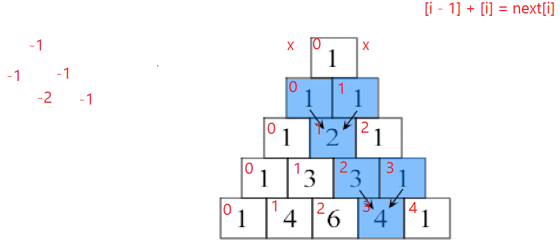

## max_num(*args):
Returns maximum number out of arguments provided, or an error message if no arguments are given.

`max_num(13,3,4,4,113,3)` \
returns `113`

## multi_list_v1(*args):
Returns product of all arguments provided, or an error message if no arguments are given.

`multi_list_v1(1,2,2,2)` \
returns `8`

## multi_list_v2(*args):
Using math import, included in Python, returns product of all arguments provided, or an error message if no arguments are given.

`multi_list_v1(1,2,2,2)` \
returns `8`

## rev_string(*strings)

Reverses all strings provided as arguments and prints the result, as an array if more than one were given. Error message if no arguments are given.

`rev_string("hello")` \
returns `'olleh'`

`rev_string("hello", "hola")` \
returns `['olleh', 'aloh']`

## num_within(num, start, end)
Returns if the `num` is between `start` and `end` (inclusive) or an error if 3 arguments have not been provided.

`num_within(5, 7, 8)` \
returns `False`

## pascal_v1(rows, initial, printEachRowBool)
During the planning for this function, I actually made an image. See bottom of readme.

Prints the pascal's triangle using the given number of `rows`, with the `initial` as the starting number, and will not print along the way if `printEachRowBool` is `False`.

If `initial` is not set, it will default to `1`. \
If `printEachRowBool` is not set, it will default to `True`.

`pascal_v1(3, 5)` \
prints

    [5]
    [5, 5]
    [5, 10, 5]
and then returns `[[5], [5, 5], [5, 10, 5]]`

`pascal_v1(5, 1, False)` \
*returns `[[1], [1, 1], [1, 2, 1], [1, 3, 3, 1], [1, 4, 6, 4, 1]]`

## print_pascal_pretty(pascalMatrix)
*From the last example.

`print_pascal_pretty(pascal_v1(5, 1, False))` \
prints

         [1]
        [1, 1]
       [1, 2, 1]
      [1, 3, 3, 1]
     [1, 4, 6, 4, 1]

Planning pascal traingle function.